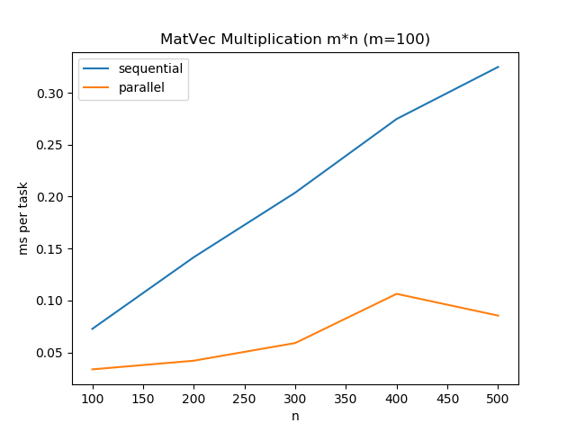
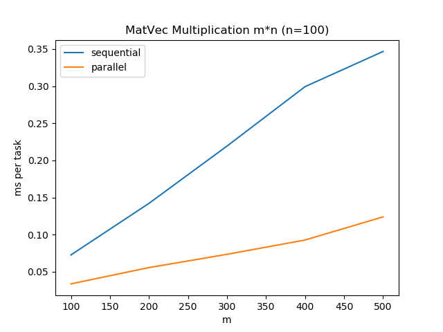
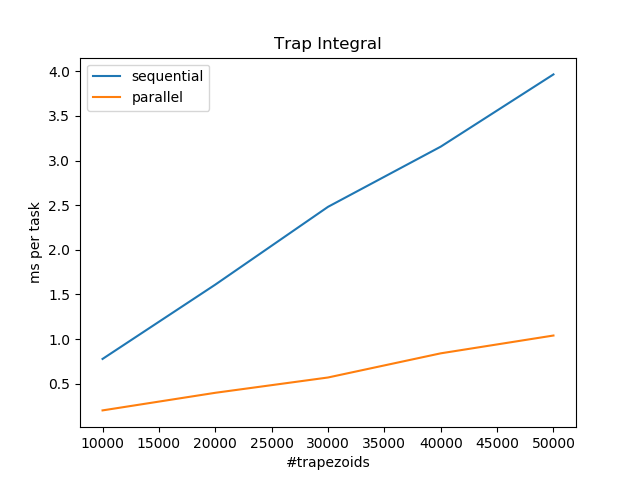
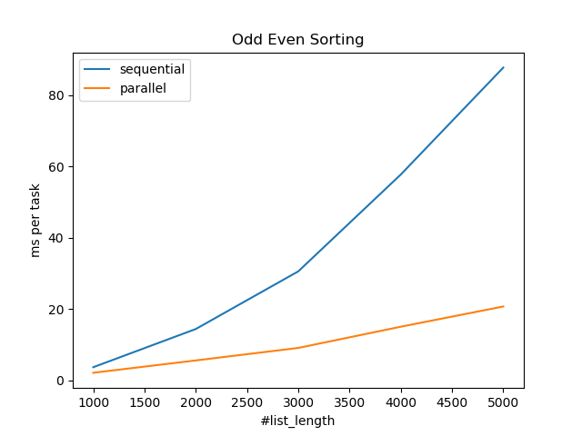

# Assignment_ParallelApp
Assignment for Parallel Programming using C++ and OpenMP
## Introduction
- `Matrix.h` and `Matrix.cpp` conduct Matrix-Vector Multiplication.
- `Trap.h` and `Trap.cpp` conduct Trapezoidal Integral.
- `OddEvenSorting.h` and `OddEvenSorting.cpp` conduct Odd Even Sort.
- `Assignment_ParallelApp.cpp` contains the main function.
## Usage
- compile with g++
```bash
g++ -c Matrix.cpp Trap.cpp OddEvenSorting.cpp Assignment_ParallelApp.cpp
```
- link with g++
```bash
g++ Matrix.o Trap.o OddEvenSorting.o Assignment_ParallelApp.o -fopenmp -o app
```

- use app
```bash
app 1  # test Matrix-Vector Multiplication
app 1 $(m) $(n)  # specify the shape (m*n) of the matrix
```

```bash
app 2  # test Trapezoidal Integral
app 2 $(range) $(n)  # specify the range of the integral interval and the number of trapezoids
```

```bash
app 3  # test Odd Even Sort
app 3 $(n)  # specify the list length
```

__Any other command will be rejected by the application.__


## Comparison between sequential process and parallel process.

- Matrix-Vector Multiplication


- Trapezoidal Integral

- Odd Even Sorting
