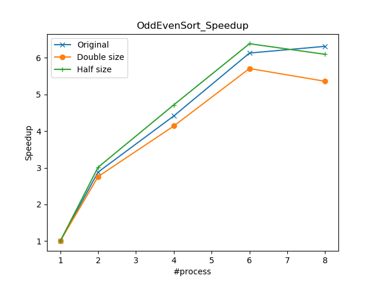
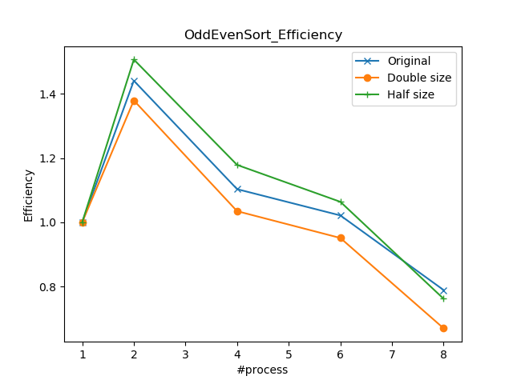

# ParallelApp_OMP
Assignment for Parallel Programming using C++ and OpenMP
## Introduction
- `Matrix.h` and `Matrix.cpp` conduct Matrix-Vector Multiplication.
- `Trap.h` and `Trap.cpp` conduct Trapezoidal Integral.
- `OddEvenSorting.h` and `OddEvenSorting.cpp` conduct Odd Even Sort.
- `ParallelApp.cpp` contains the main function.
## Usage
- compile with g++ (*using c++11*)
```bash
g++ -c Matrix.cpp Trap.cpp OddEvenSorting.cpp ParallelApp.cpp
```
- link with g++
```bash
g++ Matrix.o Trap.o OddEvenSorting.o ParallelApp.o -fopenmp -o app
```

- use app
```bash
# default arguments:
#     total = 10000
#     m = 500
#     n = 500
./app 1  # test Matrix-Vector Multiplication
./app 1 $(total)  # specify the total number of tests
./app 1 $(m) $(n)  # specify the shape (m*n) of the matrix
./app 1 $(total) $(m) $(n)  # specify the total number of tests, and the shape (m*n) of the matrix
```

```bash
# default arguments:
#     total = 10000
#     range = 100
#     n = 1000000
./app 2  # test Trapezoidal Integral
./app 2 $(range) $(n)  # specify the range of the integral interval and the number of trapezoids
./app 2 $(total) $(range) $(n)  # specify the total number of tests, the range of the integral interval and the number of trapezoids
```

```bash
# default arguments:
#     total = 10000
#     n = 1000
./app 3  # test Odd Even Sort
./app 3 $(n)  # specify the list length
./app 3 $(total) $(n)  # specify the total number of tests and the list length
```

- __Any other command will be rejected by the application.__

- __By default, the program will run on 1, 2, 4, 6, 8 core(s) successively for each test, if you want to try on more cores, you can modify the code below in__ [ParallelApp.cpp](ParallelApp.cpp).
    ```c++
    int num_cores = 5;  // Specify the number of cores
    int cores[] = { 1, 2, 4, 6, 8 };  // Specify the sequence of cores to run your test on.
    ```

## Comparisons between sequential process and parallel process.

- Matrix-Vector Multiplication


- Trapezoidal Integral


- Odd Even Sorting


